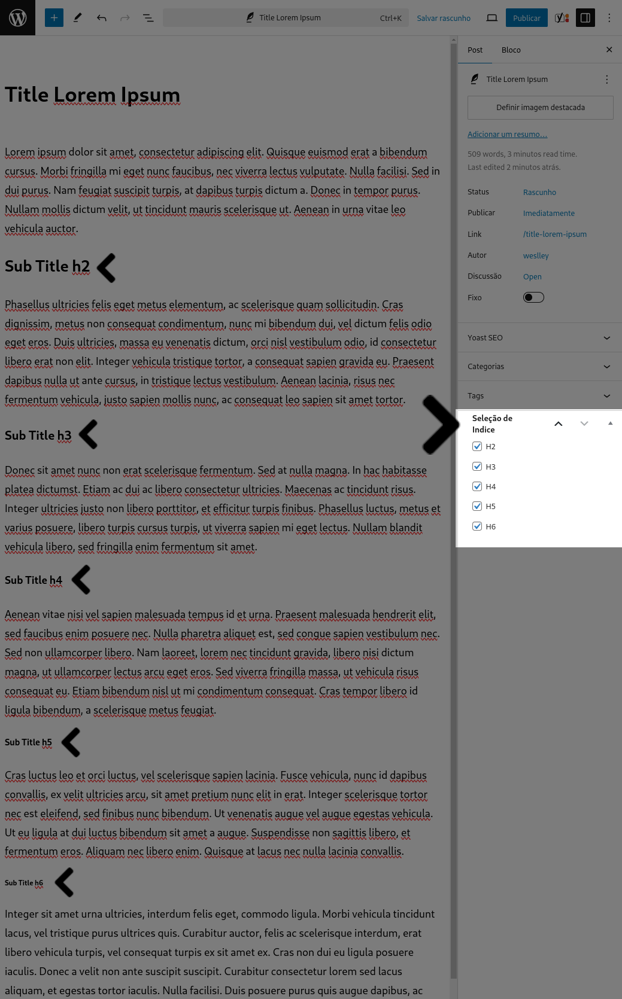

# Plugin: Table of Contents

The Table of Contents plugin automatically generates a navigable table of contents for your articles based on headers (h2, h3, h4, h5, and h6). This enhances the reading experience and navigation of your posts by adding a table of contents before the first header found in the content.

## Features
- Automatically creates a table of contents based on selected headers.
- Adds a navigable index to improve user experience.
- Customizable header selection (h2, h3, h4, h5, h6).
- Excludes h1 from the table of contents as it should be unique and used for the page title.

## Installation
1. Download the plugin files and upload them to your WordPress plugins directory (`/wp-content/plugins/`).
2. Activate the plugin through the 'Plugins' menu in WordPress.

## Usage
1. Go to the post editing screen.
2. In the sidebar, you will find a meta box titled "Index Selection".
3. Select the headers (h2, h3, h4, h5, h6) you want to include in the table of contents.
4. Save or update the post.
5. The table of contents will be automatically generated and displayed before the first header in the post content.

## Customizing the Table of Contents

You can customize the appearance of the generated table of contents by adding custom CSS to your WordPress theme. Below is an example of the CSS structure for the elements generated by the plugin:

```css
/* Title before the table of contents */
.title-table-content {
    font-size: 1.2em;
    font-weight: bold;
    margin-bottom: 10px;
}

/* Ordered list for the table of contents */
.table-content {
    list-style-type: decimal;
    padding-left: 20px;
}

/* List item for each header level */
.index-header-h2 {
    font-size: 1em;
    margin-bottom: 5px;
}

.index-header-h3 {
    font-size: 0.9em;
    margin-left: 10px;
}

.index-header-h4 {
    font-size: 0.8em;
    margin-left: 20px;
}

.index-header-h5 {
    font-size: 0.7em;
    margin-left: 30px;
}

.index-header-h6 {
    font-size: 0.6em;
    margin-left: 40px;
}

/* Link within each list item */
.index-header-link {
    text-decoration: none;
    color: #0073aa;
}

.index-header-link:hover {
    text-decoration: underline;
}

.index-anchor {

}
.index-anchor::before {
  content: "";
  display: block;
  height: 100px; /* fixed header height*/
  margin: -120px 0 0; /* negative fixed header height */
}
```

### Explanation of Generated Elements
- `<p class='title-table-content'>`: This is the title that appears before the table of contents.
- `<ol class='table-content'>`: This is the ordered list that contains the table of contents items.
- `<li class='index-header-h2'>`, `<li class='index-header-h3'>`, `<li class='index-header-h4'>`, `<li class='index-header-h5'>`, `<li class='index-header-h6'>`: These are the list items for each header level included in the table of contents.
- `<a class='index-header-link'>`: This is the link nested within each list item.
- `<a class='index-anchor'>`: This is the invisible anchor link used for navigation within the content.

Add the above CSS to your theme's stylesheet to customize the appearance of the table of contents.

## Code Explanation

### Class: WezoAlvesTableContents
- **__construct()**: Initializes the plugin by adding the necessary WordPress hooks.
- **load_textdomain()**: Loads the plugin text domain for translations.
- **add_custom_meta_box()**: Adds a custom meta box for header selection on the post editing screen.
- **display_custom_meta_box($post)**: Displays the custom meta box for selecting which headers to include in the table of contents.
- **save_custom_meta_box($post_id)**: Saves the selected headers when the post is saved.
- **content_index($content)**: Generates and inserts the table of contents into the post content.

### Note
The option to generate an index for the h1 element is not provided because it should be unique and prioritized on the page. It should be used for the page title and not for header elements within the content.

## Contributing
1. Fork the repository.
2. Create a new branch for your feature or bug fix.
3. Commit your changes.
4. Push your branch.
5. Submit a pull request.

## License
This plugin is licensed under the MIT License. See the [LICENSE](LICENSE) file for more details.

## Author
Weslley Alves  
[https://wezo.com.br](https://wezo.com.br)

## Screenshots
### Meta Box for Header Selection


### Example of Generated Table of Contents


###### Tanks
- @roryokane and Adrian Garner - Fixed page header overlaps in-page anchors https://stackoverflow.com/a/28824157/1744276